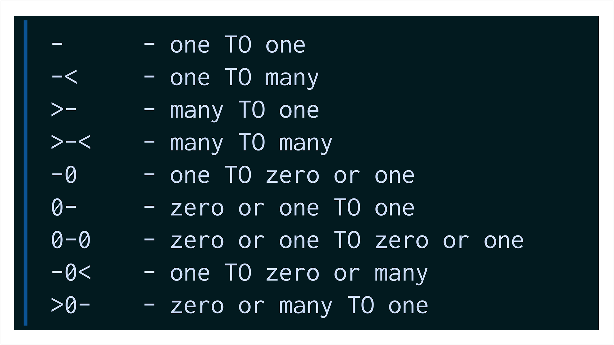

# Pewlett-Hackard-Analysis
Analysis on Employee Database using SQL

## Overview

Pewllet-Hackard (PH) is a large company with several thousand employees - many of those are baby-boomers who are currently about to retire, which could cause a massive problem. The company intends to tackle the issue in two ways:
- Offering retirement packages for those who meet certain criteria;
- Figuring out which positions will need to be filled in the upcoming years.

Bobby is an HR analyst who works at Pewllet-Hackard's and whose task is to perform employee research. 

Given how critical the current situation is, Bobby is tasked to find out:
- ***Who will be retiring in the next few years?***
- ***How many positions will PH have to fill?***

Pewllet-Hackard has not taken data seriously up to this point and still manages their employees' information in CSV files. They finally decided it was time to convert it to a solution that would allow more scalability, therefore a SQL-database was brought into scene.

Bobby has six CSV files (listed below), which should be converted to tables in a relational database making the queries he needs a lot easier and clearer. The idea was to reflect what a relational model would look like, thus, the need to create a neat database with primary and foreign keys, making all the relationships clear.
- departments.csv
- dept_emp.csv
- dept_manager.csv
- employees.csv
- salaries.csv
- titles.csv

Based on the csv files, we created an ERD (picture below). Such ERD may not be 100% right especially in what refers to cardinality, but the data is good enough to extract the information we needed.

## Results
### Number of Retiring Employees by Title
In the first query of the analysis, we aimed to find the number of retiring employees by title. In order to find that, we made a query joining the employees and titles tables and filtered on birth_date. The first 15 records are shown below.

| emp_no | first_name | last_name | title              | from_date  | to_date   |
|--------|------------|-----------|--------------------|------------|-----------|
| 10001  | Georgi     | Facello   | Senior Engineer    | 6/26/1986  | 1/1/9999  |
| 10004  | Chirstian  | Koblick   | Engineer           | 12/1/1986  | 12/1/1995 |
| 10004  | Chirstian  | Koblick   | Senior Engineer    | 12/1/1995  | 1/1/9999  |
| 10005  | Kyoichi    | Maliniak  | Senior Staff       | 9/12/1996  | 1/1/9999  |
| 10005  | Kyoichi    | Maliniak  | Staff              | 9/12/1989  | 9/12/1996 |
| 10006  | Anneke     | Preusig   | Senior Engineer    | 8/5/1990   | 1/1/9999  |
| 10009  | Sumant     | Peac      | Assistant Engineer | 2/18/1985  | 2/18/1990 |
| 10009  | Sumant     | Peac      | Engineer           | 2/18/1990  | 2/18/1995 |
| 10009  | Sumant     | Peac      | Senior Engineer    | 2/18/1995  | 1/1/9999  |
| 10011  | Mary       | Sluis     | Staff              | 1/22/1990  | 11/9/1996 |
| 10018  | Kazuhide   | Peha      | Engineer           | 4/3/1987   | 4/3/1995  |
| 10018  | Kazuhide   | Peha      | Senior Engineer    | 4/3/1995   | 1/1/9999  |
| 10019  | Lillian    | Haddadi   | Staff              | 4/30/1999  | 1/1/9999  |
| 10020  | Mayuko     | Warwick   | Engineer           | 12/30/1997 | 1/1/9999  |
| 10022  | Shahaf     | Famili    | Engineer           | 9/3/1999   | 1/1/9999  |

This query proved not to be good for our purpose. It is easily seen in the first records that it returns duplicates and we need unique records. We can easily see that the duplicate records show the same employee taking different job positions - which makes sense since employees have different positions throughout their careers.

### Number of Retiring Employees by Titles - Version 2
In a second attempt, the idea was to remove the duplicates. In order to obtain unique records, we modified the previous query adding *DISTINCT ON* matching with the *ORDER BY* clause as follows:

SELECT DISTINCT ON (r.emp_no)
		r.emp_no, r.first_name, r.last_name, r.title
INTO unique_titles	
FROM retirement_titles r
WHERE r.to_date = '9999-01-01'
ORDER BY r.emp_no, r.to_date desc;

In fact, the same result could be achieved if instead we had filtered the initial query by the to_date in the titles table as '9999-01-01' - meaning the ones whose to_date is '9999-01-01' are still active. It would have been simpler, but the result would be still the same: 

SELECT r.emp_no,
		r.emp_no, r.first_name, r.last_name, r.title
INTO unique_titles	
FROM retirement_titles r
WHERE r.to_date = '9999-01-01'
ORDER BY r.emp_no, r.to_date desc;

The data returned by the above queries (first 15 records) is listed below - and shows the duplicates were eliminated.

| emp_no | first_name | last_name  | title           |
|--------|------------|------------|-----------------|
| 10001  | Georgi     | Facello    | Senior Engineer |
| 10004  | Chirstian  | Koblick    | Senior Engineer |
| 10005  | Kyoichi    | Maliniak   | Senior Staff    |
| 10006  | Anneke     | Preusig    | Senior Engineer |
| 10009  | Sumant     | Peac       | Senior Engineer |
| 10018  | Kazuhide   | Peha       | Senior Engineer |
| 10019  | Lillian    | Haddadi    | Staff           |
| 10020  | Mayuko     | Warwick    | Engineer        |
| 10022  | Shahaf     | Famili     | Engineer        |
| 10023  | Bojan      | Montemayor | Engineer        |
| 10026  | Yongqiao   | Berztiss   | Senior Engineer |
| 10035  | Alain      | Chappelet  | Senior Engineer |
| 10047  | Zvonko     | Nyanchama  | Senior Engineer |
| 10051  | Hidefumi   | Caine      | Senior Engineer |
| 10053  | Sanjiv     | Zschoche   | Senior Staff    |

The totals returned in unique_titles are the following:

| Title                | total |
|----------------------|-------|
| "Assistant Engineer" | 1090  |
| "Engineer"           | 9285  |
| "Manager"            | 2     |
| "Senior Engineer"    | 25916 |
| "Senior Staff"       | 24926 |
| "Staff"              | 7636  |
| "Technique Leader"   | 3603  |

### Finding employees eligible for the Mentorship Program

## Summary
